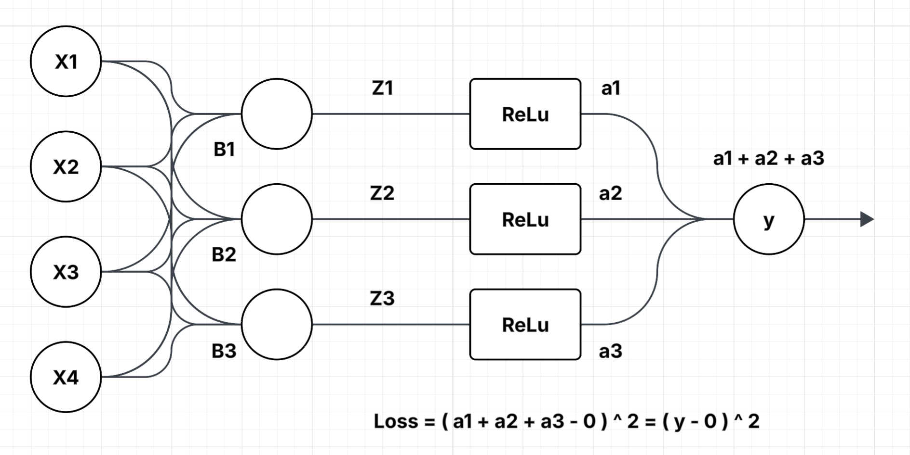
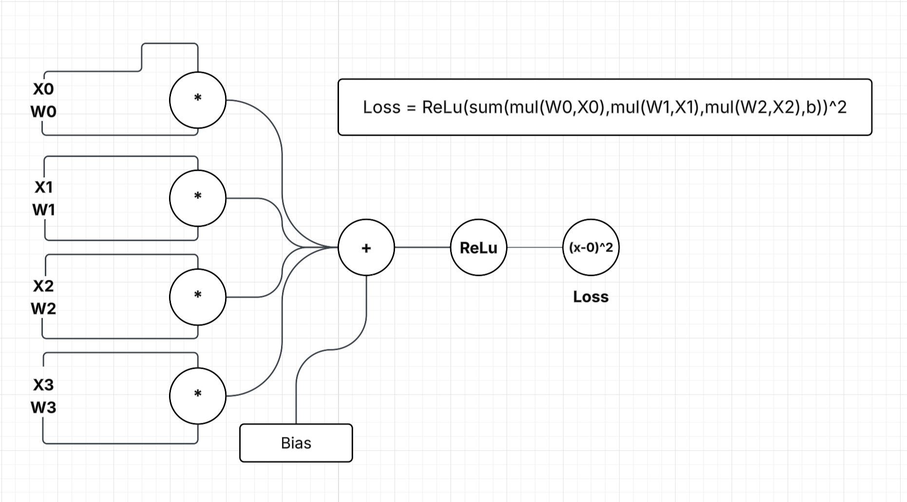

# Back propogation optimisation for neural networks ( from scratch )

This project implements a single fully-connected neural network layer with manual backpropagation, built completely from scratch using only NumPy.

No TensorFlow.
No PyTorch.
No automatic differentiation.

Every gradient is calculated manually using calculus and the chain rule.

## The network:

•	Takes a fixed input vector<br>
•	Passes it through a dense (fully connected) layer<br>
•	Applies ReLU activation<br>
•	Sums outputs to produce a scalar prediction<br>
•	Computes squared loss<br>
•	Updates weights using gradient descent<br>
•	Repeats for multiple iterations<br>

This project uses:

- **Python**
- **NumPy**

## Get Started

Clone the repository:

```bash
git clone https://github.com/yashdeep7733/back-propogation-neural-network-optimisation
cd back-propogation-neural-network-optimisation
pip install numpy
python back-propogation-default.py
```

<p align="center">
  
  
</p>
